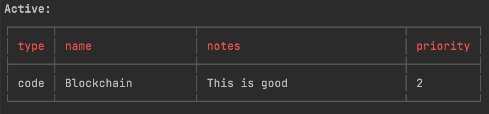

# Eisenhower

### A simple task tracking manager that helps you focus on what matter.

#### This is an inspiration from the Eisenhower Matrix.




## Usage

```
    🔎  eisenhower 

    Usage:

      eisenhower  [<flags>] <command> [<args> ...]

    Flags:

      -h, --help                Output usage information.
      -v, --version             Show application version.

    Commands:

      h, help                   Output usage information.
      n, new                    Create a new project.
      v, view                   View a project's information.
      l, list                   View all project information.
      c, complete               Mark a project as completed.
      f, finish                 Mark a project as completed.
      d, delete                 Delete an existing project.
      r, remove                 Delete an existing project.

    Examples:

      Create a new project.
      $ eisenhower new

      View the 'laundry' project.
      $ eisenhower view laundry

      Delete the 'laundry' project.
      $ eisenhower delete laundry

      List all projects.
      $ eisenhower
        or
      $ eisenhower list
```
